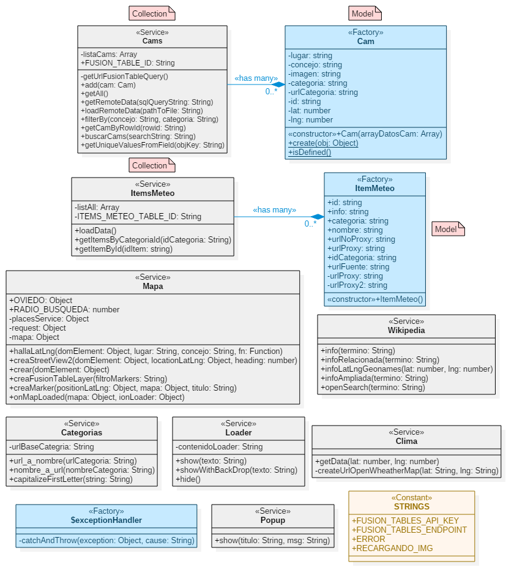

  

# Webcams del Principado

**Aplicación Web Progresiva ([PWA](https://developers.google.com/web/progressive-web-apps/)) que muestra Imágenes de cámaras web situadas en el Principado de Asturias**

Este es un proyecto experimental que pone en práctica diversos patrones, arquitecturas y tecnologías en una aplicación desarrollada en AngularJS.

> **NOTA**: Las imágenes han sido omitidas por reclamaciones de copyright pero se ha dejado el proyecto online como referencia para posteriores consultas del autor o de cualquier persona interesada en los conceptos técnicos que se utilizan. Cualquier comentario o sugerencia puede ser formulado en la sección "*Issues*".

## Características

- Arquitectura:
  - Business Layer diseñada en base a **Programación Orientada a Objetos**
  - Uso del **Patrón MVC** para separación de responsabilidades
  - Uso de los patrones **Data Mapper** / **Repository** para gestionar las consultas a la base de datos
  - Uso de **Route Resolvers**
  - Uso de una **base de datos NoSQL** ligera para mantener el estado en memoria
    - En este caso y debido a su simplicidad, el estado de la aplicación consiste en una colección de objetos JSON que se cargan desde el backend y se mantienen en memoria. 
    - Las consultas han sido diseñadas ad hoc sin ninguna otra capa de abstracción adicional.
    - La persistencia se lleva a cabo mediante una base de datos de Google Fusion Tables.

  (NOTA: las nuevas versiones de Angular utilizan una arquitectura basada en componentes en lugar del Patrón MVC). 

  Referencias:

  - <a href="https://toddmotto.com/rethinking-angular-js-controllers/">Rethinking AngularJS Controllers</a>.
  - <a href="https://medium.com/opinionated-angularjs/angular-model-objects-with-javascript-classes-2e6a067c73bc">AngularJS Model Objects with JavaScript Classes</a>.
  - <a href="https://medium.com/opinionated-angularjs/advanced-routing-and-resolves-a2fcbf874a1c">AngularJS Advanced Routing and Resolvers</a>.

- Posibiliad de instalación local (tanto móvil como desktop) gracias al uso de un fichero `manifest.json` 

- Capacidad de funcionamiento off-line por medio de un [service worker](https://developer.mozilla.org/en-US/docs/Web/API/Service_Worker_API)

## Demo

- <a href="http://mobt.me/XfKL" target="_blank">Simulador móvil</a>

- <a href="http://yagolopez.github.io/Webcams_de_Asturias/www/" target="_blank">Pantalla grande</a>

- Usar QR code para ver en smartphone:

## Funcionalidad

Las cámaras están agrupadas según las siguientes categorías:

- Playas
- Poblaciones
- Puertos (marítimos)
- Montaña

Hay tres formas de visualizar las imágenes de las webcams:

- Listado
- Mosaico
- Mapa

También se pueden filtrar según distintos criterios:

- Por categoría
- Por concejo
- Búsqueda por cadena de texto

Como valor añadido se pueden consultar diversas informaciones, como la temperatura,
imágenes de satélite, y estadísticas de la base de datos.

## Modelo UML

## Tecnologías

- Ionic Framework 1+ (Interfaz de usuario)

- AngularJS

- Base de Datos: Google Fusion Tables

- Intel Crosswalk Runtime (Compilación cruzada a Android e IOS)

  ​

---

**(English)**

**Progressive Web App (PWA) showing real time images from webcams located at the Principality of Asturias**

- This is an experimental project to put in practice several patterns, best practices and technologies using the AngularJS framework. It has been created as reference for the author or anyone interested in this topic. Feel free to send any comment or sugerence in the Issues section.

- Architecture and features:
    - Business Layer design based on **Object Oriented Programming**
    - Use of **MVC Pattern** for separation of concerns
    - Use of **Route Resolvers**
    - Use of a designed ad hoc and lightweight **JSON in memory database**.
    - Use of **Service Worker** to enable off-line capabilities (**PWA**)

    NOTE: Modern versions of Angular use a component-based architecture instead of MVC Pattern.

- References:
  - <a href="https://toddmotto.com/rethinking-angular-js-controllers/">Rethinking AngularJS Controllers</a>

  - <a href="https://medium.com/opinionated-angularjs/angular-model-objects-with-javascript-classes-2e6a067c73bc">AngularJS Model Objects with JavaScript Classes</a>

  - <a href="https://medium.com/opinionated-angularjs/advanced-routing-and-resolves-a2fcbf874a1c">AngularJS Advanced Routing and Resolvers</a>

    ​

<a href="#">Back to top :arrow_up:</a>
